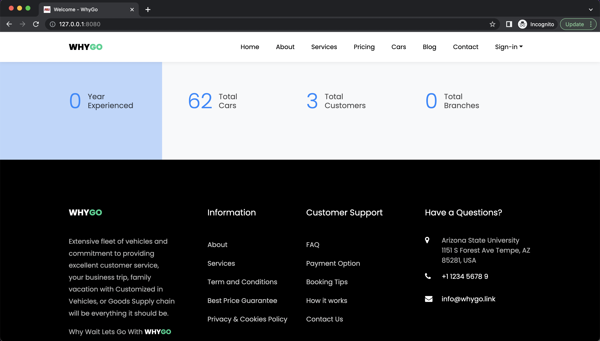

# This Project is Under development 🚧

## WebDevelopment-RentalCars

A rental car is a vehicle that is leased or rented by individuals or companies for a specific period of time. These cars can be rented for a variety of reasons, including business travel, vacations, or as a temporary replacement for a personal vehicle that is being repaired or serviced.

Rental cars come in a variety of sizes and models to fit different needs. Economy cars are smaller, more fuel-efficient vehicles that are ideal for city driving and shorter trips. Mid-size and full-size cars are larger and more comfortable, making them ideal for longer trips or when traveling with a family or a group of friends. SUVs and minivans offer even more space, making them ideal for hauling large amounts of cargo or accommodating a larger group of passengers.

### Programming Languages:
- The programming language used in the entire backend application is **Python**.
- Using **Python**, we have followed a microservices type of strategy where we have written the entire code in an object-oriented way using an inheritance approach where we have declared user-defined expectations in one class and constant in another class as well as have a base class that acts as a model to **python flask endpoints**.
- In the model, we have used SQL query to retrieve data from MySQL database and store and update the data to MySQL based on API call in python flask.
- For the two-factor authentication, we have used an open-source python package **PyOTP**, and we have implemented time-based OTP authentication via google authenticator.
- In the front-end development, we have used HTML with the bootstrap framework to develop a responsive website to open on any device, such as a mobile phone, iPad, tablet, desktop, or laptop.
- Finally, we have used **JavaScript** for server-side scripting to copy data from one page to another and also to validate HTML forms like a search bar on a table, etc. We have used **chart.js** to create various charts on the dashboard, which will interact with the database using the python flask endpoint.

### Infrastructure Architecture

### Entity Relationship Diagram:

### Login Page Images

#### Web Pages Images

